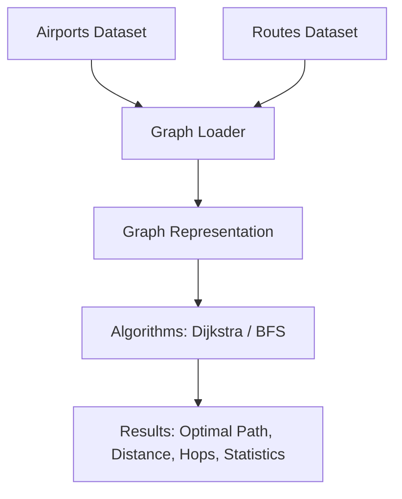

# Flight Route Optimizer Tool

## Overview

 A **C++ backend project** that computes the most efficient flight paths between airports using advanced **Graph Algorithms** such as **Dijkstra’s Algorithm** & **BFS**.

**FlightPathOptimizer** leverages graph theory on large, real-world aviation datasets. It treats airports as **nodes** and flight routes as weighted **edges** (where the weight is the distance in kilometers). The tool is designed for performance and scalability, successfully modeling:

* **7500+** Airports Loaded
* **65000+** Routes Loaded
---

##  Features  

- **Shortest Path Finder:**  
  - Computes the most efficient route between two airports using **Dijkstra’s Algorithm**.  
  - Returns both **total distance** and **minimum number of hops (stops)**.  

- **Airport Lookup & Statistics:**  
  - Query airport details instantly by **IATA code** (e.g., `DEL`, `LAX`).  
  - Identifies the **Top 5 busiest airports worldwide** based on route volume and connectivity.  

- **Interactive CLI:**  
  - A **user-friendly, menu-driven console interface** for smooth navigation.  
  - Step-by-step guidance for shortest path queries, airport lookups, and network statistics.  

- **Performance & Scalability:**  
  - Optimized to handle large-scale aviation datasets with **7,700+ airports** and **67,000+ routes**.  
  - Delivers near-instantaneous query results even with thousands of nodes and edges.  
---

## Tech Stack

- **Language**: C++17  
- **Algorithms**: Dijkstra’s Algorithm, BFS
- **Data Structures**: Graphs (Adjacency List), Priority Queues, Hash Maps  
- **Build Tools**: CMake, GCC/Clang/MSVC  
- **Dataset**: Airports (7698), Routes (67663)  

---

##  System Architecture



---

## Example Results

| Source | Destination | Optimal Path                          | Distance (km) | Hops |
|--------|-------------|----------------------------------------|---------------|------|
| DEL    | ORD         | DEL → ORD                             | 12021.28      | 1    |
| DEL    | LAX         | DEL → PEK → LAX                       | 13846.07      | 2    |
| ATL    | DEL         | ATL → YYZ → LHE → DEL                 | 12856.37      | 3    |


## Project Structure
```makefile
FlightPathOptimizer/
│── include/            # Header files (Graph, Airport, Route)
│── src/                # Implementations (Graph.cpp, Airport.cpp, Route.cpp, main.cpp)
│── data/               # Input datasets (airports.dat, routes.dat)
│── CMakeLists.txt      # Build configuration
│── README.md           # Documentation

```
---
## Installation  

### Prerequisites  
- **C++ Compiler:** Ensure you have a C++ compiler installed (e.g., GCC, Clang).
- **CMake:** Required for building the project.
---

### Steps  

#### 1. Clone the Repository  
```powershell
git clone https://github.com/Kritvi0208/FlightPathOptimizer.git
cd FlightPathOptimizer
````

#### 2. Prepare the Data Files

* Place your `airports.dat` and `routes.dat` files inside the `data/` directory.
* Ensure the files follow the correct format.

#### 3. Build the Project

```powershell
mkdir build
cd build
cmake ..
cmake --build .
```

#### 4. Run the Application

```powershell
.\Debug\flightPathOptimizer.exe
```
---

## Usage  

1. **Loading Data** – The application automatically reads `airports.dat` and `routes.dat` from the `data/` directory.  
2. **Finding Routes** – Use the interactive CLI to compute the shortest paths between airports, showing both distance and number of hops.  
3. **Airport Insights** – Quickly lookup airports by IATA code and explore network statistics like the Top 5 busiest airports.  
---

## Future Enhancements

- Time-based optimization (flight duration, layovers)
- Cost-based optimization (ticket prices)
- Visualization of computed routes via GUI or web map
- Real-time flight data integration through APIs
- REST API conversion for integration with travel & logistics systems
---
## Author

Ritvika
[GitHub Profile](https://github.com/Kritvi0208)

```

